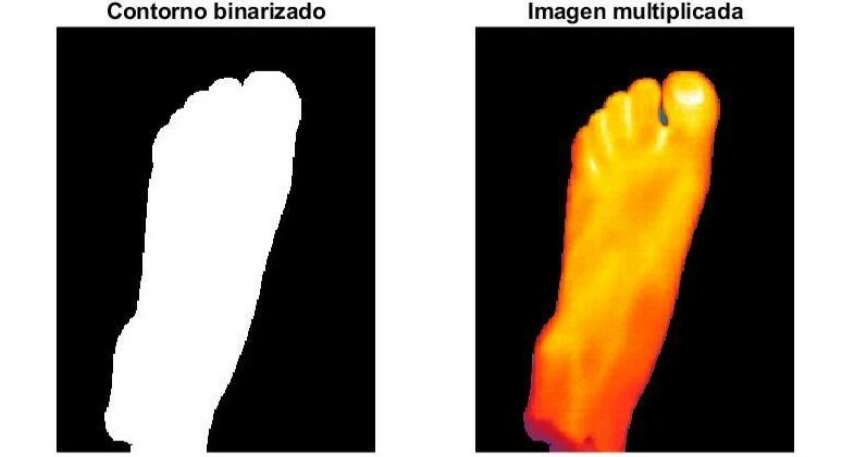
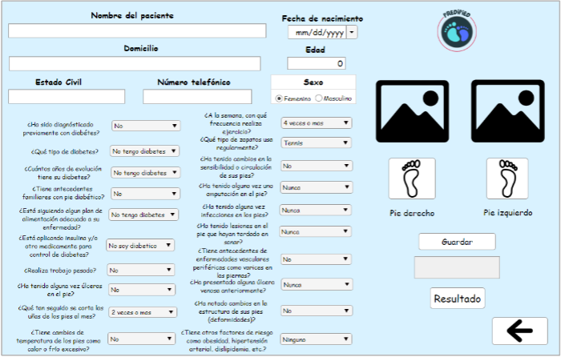

# Pre-clasificador de Pie Diabético Usando Termografía y Machine Learning

Este repositorio contiene los algoritmos y cuadernos de trabajo del proyecto "Sistema de Pre-clasificación de Pie Diabético", desarrollado en la Universidad Politécnica de Chiapas. El objetivo es crear una herramienta de bajo costo para el tamizaje temprano de esta complicación, utilizando imágenes termográficas y técnicas de visión por computadora.

El sistema se basa en el análisis de la distribución de temperatura en la superficie plantar del pie para identificar patrones anormales que puedan indicar un riesgo elevado de ulceración. Se utilizan algoritmos para el preprocesamiento de imágenes, la extracción de características térmicas y la clasificación mediante Máquinas de Soporte Vectorial (SVM).

## 📄 Publicación

Este trabajo ha sido publicado y está disponible en la revista **Ciencia Latina**. Puedes consultar el artículo completo en el siguiente enlace:

* **[Ver Artículo en Ciencia Latina](https://ciencialatina.org/index.php/cienciala/article/view/8894/13245)**

---

## Metodología

1.  **Adquisición de Imágenes:** Se capturan imágenes termográficas de la región plantar.
2.  **Preprocesamiento:** Se aplican técnicas de segmentación para aislar el pie del fondo.
3.  **Extracción de Características:** Se calculan descriptores estadísticos de la temperatura en diferentes regiones anatómicas del pie.
4.  **Clasificación:** Se entrena un clasificador SVM para distinguir entre pies sanos y pies en riesgo.

## Requisitos

Las librerías de Python necesarias para ejecutar los notebooks y scripts se encuentran en `requirements.txt`.

```bash
pip install -r requirements.txt
```

<h2 align="center">📸 Vistas del Proyecto</h2>

<p align="center">
  
  <br>
  <em>Proceso de binarización y segmentación de las imágenes térmicas.</em>
</p>
<p align="center">
  
  <br>
  <em>Interfaz gráfica del cuestionario de tamizaje.</em>
</p>
